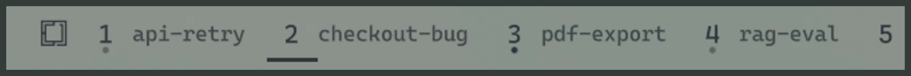

# Agent Workspaces

**Your OS is the harness.** No tmux, no session manager, no second window listing what is
running. Omarchy's workspace strip becomes the thing that tells you what every coding-agent
session is doing — Claude Code, Codex and Muse Code — because the workspaces are already
there, already on screen, and already one keystroke apart.



Four pieces of work, one glance: the PDF export is running, the checkout bug is waiting on
you, the API retry and the RAG eval are idle. A workspace with nothing in it stays a plain,
dim number.

## What the marks mean

| Mark | Meaning |
|---|---|
| A bright dot | the session is working |
| A dim dot | the session is idle, waiting for you to type |
| A rule under the number | the session needs you: a permission prompt, an elicitation |
| A rule above the number and name | this is the workspace you are on |
| A small `C`, `X` or `M` | which agent is in the slot: Claude Code, Codex, Muse Code |

Several sessions can share a workspace. The slot shows the focused one's name and the worst
state of the group, so a workspace never looks calm while something in it is stuck. Hover it
to see them all.

Every mark takes its colour from your active Omarchy theme. Change the theme and the strip
changes with it.

## When something finishes

A dot dimming is no use on a workspace you are not looking at, so the same moment also plays
a short sound and raises an Omarchy notification saying which workspace finished and what it
was doing.

It fires only when the slot actually changes. Anything else still working in that workspace
leaves the dot bright and nothing is said — including a window that was open before the plugin
was installed, which the bar counts by its title alone. A workspace in front of you on any
monitor has already shown you, and stays silent. A window you moved is announced against the
workspace it is on now.

Both parts are on by default and are turned off, or pointed at a sound of your own, in
`~/.config/omarchy/agent-workspaces.json` — a file the plugin reads and never writes:

```json
{ "finish_sound": "/usr/share/sounds/freedesktop/stereo/complete.oga", "finish_toast": true }
```

`false` for either switches it off, quoted or not. A `finish_sound` that is not a file we can
play falls back to the default rather than reaching a player. The sound goes to whichever of
`pw-play`, `paplay` or `canberra-gtk-play` is installed; a machine with none of them still gets
the notification.

## Three agents

Claude Code, Codex and Muse Code all show up the same way. Install wires whichever of them is
actually on your machine and skips the rest.

Each agent is asked to name itself: the hook line install writes into that agent's own config
says which agent it belongs to, so the strip is told rather than guessing. An earlier version
guessed from the process tree, and three review rounds broke the guess three different ways —
a program whose name merely started the same, one agent launched inside another's window, and
one event name shared by two agents. The guess survives only as a fallback for a hook you
wired by hand, and when it cannot tell, the slot stays empty rather than showing the wrong
thing.

Two of the three need a word about how they are wired:

- **Codex** will not run a hook nobody has approved. The first time you start it after
  installing, it says hooks are new or changed and offers to review them, trust them all, or
  continue without trusting. Choose to trust them once and Codex joins the strip. We do not
  write that approval for you: it is Codex asking you, not us.
- **Muse Code** reads a hook file only from the folder you are working in, so there is no one
  file that would cover every project. Install therefore adds a small Muse plugin instead,
  through Muse's own `muse plugins install --scope user`, and approves it in the same step.
  Uninstall removes it.

Working and idle are free where an agent already says so in its terminal title — all three do,
Claude with one mark and Muse and Codex with a second one they share — and come from the hooks
otherwise, which is what covers an agent that has gone quiet.

## Names

A session names its own workspace. The name comes from the title the agent gives the chat:
first a name derived on the spot, then a better one from Haiku about seven seconds later,
cached so a title costs one call ever. Codex and Muse both title their windows with the folder
they were started in rather than the work, so for those two the name comes from the request the
session opened with — read once, from the session's own transcript, so the slot does not rename
itself all evening. Muse tells its hooks it has no transcript, so we go and find the log it keeps
for itself, under its own data folder, by session id.

- `Localsend not finding iPhone on omarchy` → `localsend-ios`
- `Build story engine compose.py with beat vocabulary` → `compose-beats`
- `Skip permissions dangerously` → `perms-danger`

The better name costs one `claude -p` call per distinct title, whichever agent the session
belongs to. **The window title is sent to the Anthropic API** — or, for Codex and Muse, the
opening line of your first request. Nothing else: not the rest of the transcript, not your
working directory, not the session id. An agent renames a chat as it
goes, so a long session may cost a few calls over its life, one per new title. Set
`AGENT_WS_NO_AI=1` to turn this off and keep the plain derived names, which need no network
at all.

Close the session and the name goes with it — unless you gave the workspace a name yourself,
in which case it stays, and so does the workspace's memory of what ran in it.

## Keys

| Key | What it does |
|---|---|
| `Super + R` | Name this workspace. Enter accepts the suggestion. |
| `Super + Shift + R` | Forget the name. Sessions and windows stay. |
| `Super + Shift + Alt + R` | Reset: forget the name, forget what it remembered, close its agent windows. Asks first whenever anything would be lost — including when the windows are already closed but the workspace still remembers them. |

Those three keys are free in a stock Omarchy; install adds them and nothing else. **It never
rebinds a key you already have.**

## Opening sessions

`agent-ws launch` opens an agent in the workspace you are on, or brings back the sessions a
named workspace remembers — each one reopened with its own agent, told to resume the session
it was, so a Codex session is never reopened as Claude. Press it again once they are open and
you get a fresh one alongside them. It is deliberately not bound to anything: pick your own key.

```lua
-- ~/.config/hypr/bindings.lua
o.bind("SUPER + SHIFT + A", "Agent", "agent-ws launch")
```

That particular key is Omarchy's ChatGPT shortcut, and Omarchy's defaults load first, so add
`hl.unbind("SUPER + SHIFT + A")` above the line if you want to take it over.

A fresh one runs plain `claude`. To give it your own flags, or start it somewhere other than
your home directory, write `~/.config/omarchy/agent-workspaces.json`:

```json
{ "launch": ["claude", "--dangerously-skip-permissions"], "cwd": "~/code" }
```

Workspace names you set yourself live in `~/.config/omarchy/workspace-names.json`, one line
per workspace, and survive reboots:

```json
{ "2": "rss-digest", "4": "matchstory" }
```

It only ever closes a window it can tie to a session it started. A window it does not
recognise is left alone, even if it is sitting in the workspace you are resetting.

## Install

```bash
omarchy plugin add https://github.com/YotamPeled/omarchy-agent-workspaces.git
~/.config/omarchy/plugins/io.github.yotampeled.agent-workspaces/install
```

The first command installs the bar widget. The second puts `agent-ws` on your PATH, adds the
hooks to each installed agent's own config, adds the keybindings, and swaps our widget in for
Omarchy's workspace strip. It only ever adds what is missing, so running it twice is safe, and
it tells you which agents it found and which it skipped.

To remove it:

```bash
~/.config/omarchy/plugins/io.github.yotampeled.agent-workspaces/uninstall
omarchy plugin remove io.github.yotampeled.agent-workspaces
```

Uninstall takes back what install added and only that. It matches its own hook entries
exactly, so a hook of your own that also calls `agent-ws` survives — one with your arguments,
your timeout or your own wrapper around it. The one exception is a line byte-identical to what
an older version of this installer wrote, which we cannot tell from our own: installing
replaces it with the current line, and uninstalling takes that back. It writes Omarchy's
workspace strip back into the exact slot it took, in whichever bar section that was — and if
install had nothing to replace, uninstall removes our widget rather than inventing one. Files
install created on a bare machine are deleted again rather than left as empty husks. If one
of your config files has a syntax error, uninstall says so and carries on with the rest
instead of stopping half-done.

`shell.json` and `settings.json` come back with the same content but reformatted at two-space
indent, which is Omarchy's own style. Your state directory is left alone; delete
`~/.local/state/omarchy/agent-workspaces` yourself if you want it gone.

`test/sandbox-install.sh` and `test/edge-cases.sh` prove all of this against a throwaway home
directory, across all three agents and across machines where only some are installed.
`test/strip-logic.sh` drives the widget's own decisions with made-up windows and records. Run
them.

## How it works

Nothing here patches Omarchy. The widget is a normal shell plugin in `~/.config/omarchy/`,
loaded after the packaged defaults, so an `omarchy update` cannot break it.

Install does edit files you own — `~/.claude/settings.json`, `~/.codex/hooks.json`,
`~/.config/hypr/bindings.lua` and `~/.config/hypr/autostart.lua`, plus your `shell.json` — and
installs one Muse plugin. It reads one file it never writes,
`~/.config/omarchy/agent-workspaces.json`, for the finish sound and notification. Everything
it adds is marked, and uninstall takes back exactly what
it added and nothing else, including a hook of your own that happens to be written the same
way ours is.

`agent-ws` is one small Python program that owns every fact the bar needs, in JSON files under
`~/.local/state/omarchy/agent-workspaces/` (sessions, needs, name cache, plus lock files and a
small debug log). Each agent's hooks feed it: session start and end, permission prompts,
prompts submitted, tool calls, and the end of a turn. The bar reads those files and watches
Hyprland; it never asks any agent anything.

Where an agent writes a status mark into its terminal title, the bar reads that instead,
because the titles are ones Hyprland is holding anyway — which is why Claude's state is
instant and costs nothing, and why Muse's working mark is too. The flip side: any window whose
title happens to start with one of those marks is *shown* as a session. It will not be closed
by a reset — that needs a real session record — but it will occupy a slot until you retitle it.
Muse and Codex share one mark, so a title alone never says which of the two is running; the
letter in the slot comes from the record its hooks wrote, or is left off.

## Requirements

Omarchy with the Quickshell bar, Hyprland, Python 3, and at least one of Claude Code, Codex
and Muse Code. `~/.local/bin` on your
PATH. `omarchy-launch-tui` and `omarchy menu` come with Omarchy and are used for opening
sessions and for the reset confirmation. The finish sound wants one of `pw-play`, `paplay`
or `canberra-gtk-play`, and is skipped if none is installed.

## Licence

MIT.
